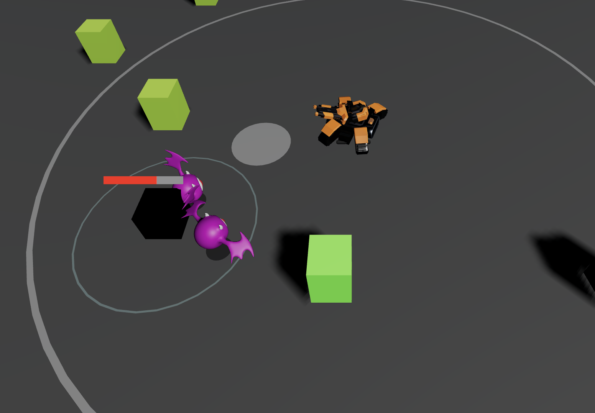
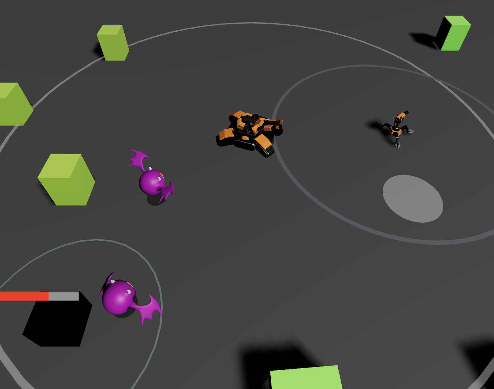

# Tankfall 3D

Welcome to **Tankfall**, a personal project of mine where I combine my passion for 3D modeling and web development. As a student exploring the intersection of these fields, I've built this interactive 3D game using **Three.js** for rendering and **Cannon.js** for physics.

🚀 **[Play Tankfall here!](https://konradkunkel.github.io/tankfall/)**

## 🎮 Gameplay
In Tankfall, you control a high-tech tank in a stylized 3D environment. The goal is to survive waves of enemies by utilizing your mobility and firepower.

- **Combat Mode**: Press `Space` to enter combat mode, where your turret follows your cursor and you can unleash powerful shots.
- **Strategic Upgrades**: Earn score by destroying enemies and use it to upgrade your shot radius or reduce your weapon cooldown.
- **Turret Defense**: Deploy automated turrets to help defend your position (press `Q` or use the UI button).
- **Physics-Driven World**: Every explosion and collision is calculated using a physics engine, making the combat feel impactful and dynamic.

## 📸 Screenshots

| Exploration | Combat Mode |
| :---: | :---: |
|  |  |

## 🛠️ Tech Stack
This project was a great opportunity for me to dive deep into several technologies:
- **Three.js**: Used for the 3D scene, lighting, and GLTF model loading.
- **Cannon-es**: A physics engine for handling realistic tank movement and collision detection.
- **Vite**: For a fast development environment and optimized production builds.
- **Custom 3D Models**: I've integrated custom models for the tank, enemies, and turrets to give the game a unique look.

## ⌨️ Controls
- **Movement**: `W`, `A`, `S`, `D` or **Arrow Keys**
- **Toggle Combat Mode**: `Space`
- **Shoot**: **Left Click** (while in Combat Mode)
- **Place Turret**: `Q` or use the **UI Button**
- **Pause Menu**: `Esc`
- **Debug Hitboxes**: `F2`

---
*Created by a student passionate about 3D and code.*
